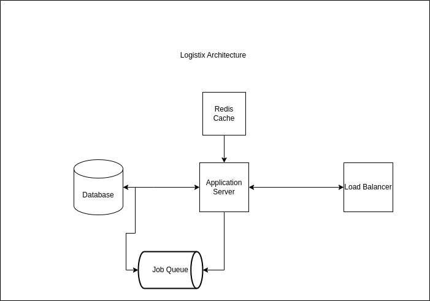

# Logistix 

An simple service to manage the delivery of products to customers.

## Features 
1. Authentication 
2. Package ordering by users 
3. Realtime package tracking 
4. Package status update 
5. Automated package job update 

## Technologies 
1. Python 
2. Flask 
3. Sql 
4. Redis 
5. Docker 
6. Docker-compose 

## Design Architecture 

